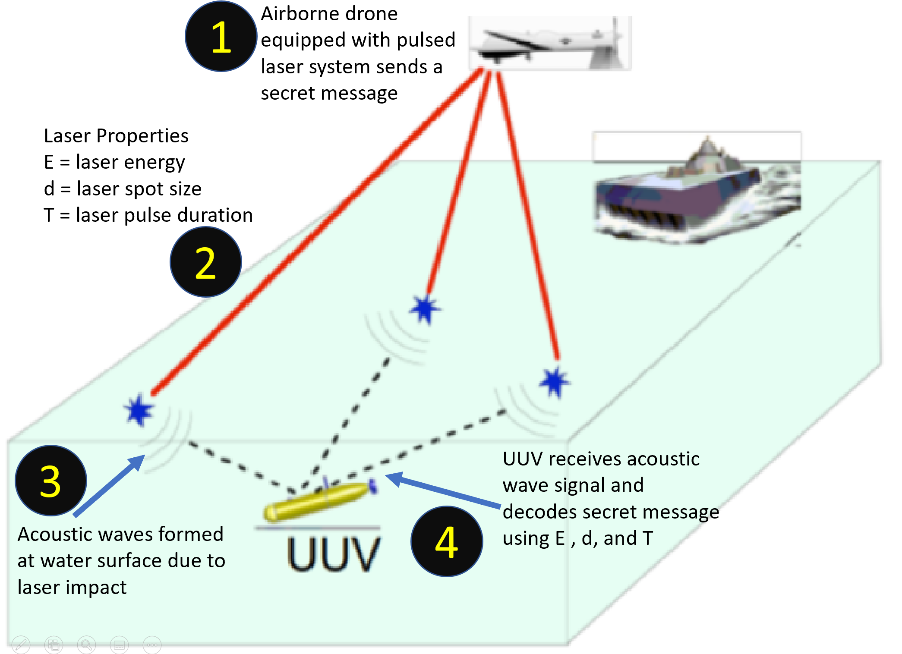

# AcoustiveWaveSim
The goal of the project is to develop computational tools to model the acoustic signal propagation from a plasma created under water by a high peak power laser pulse. In particular this effort will concentrate on cylindrical shaped plasmas.
  
